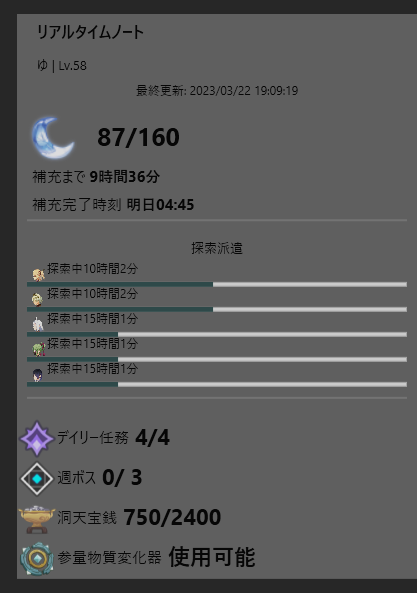

# TaoTray

Windows向け原神ステータス確認ソフト

# 特徴
- タスクトレイ常駐ソフト
- 天然樹脂が溢れそうなときや探索派遣の完了時などに通知
- English Support.

# 要件(Requirements)
- Windows10・11
- [.NET6.0以上のランタイム](https://dotnet.microsoft.com/ja-jp/download/dotnet)
- [Microsoft Edge WebView2 ランタイム](https://developer.microsoft.com/ja-jp/microsoft-edge/webview2/#download-section)
- HoyoLab通行証(ゲーム内アカウントと紐付け済み)

# 使い方(usage)
- TaoTray.exeを起動する
- ブラウザが出てくるのでログインしたあと「OK」ボタンを押す
- アカウントが複数ある場合は選択画面が出てくるので選択する
- 正常に追加できた通知が飛んでくれば完了
- タスクトレイの胡桃のアイコンをクリックすると表示
- タスクトレイアイコン右クリックでメニューが表示

## For use in English (英語で使う場合)
You cannot change the language in the in-app settings at the moment,
so please open `config.json` and change `Language` to `en-us` manually.

Translated using DeepL. If you find any errors, please send me a pull request.

## 自動起動のやり方
- ドキュメントやAppData内など安全な場所にソフトのフォルダを移動させてください。
- Win + Rで`shell:startup`と入力してスタートアップフォルダを開きます
- `TaoTray.exe`のショートカットを作成してスタートアップフォルダに移動させます。

# 免責
本ソフトウェアは[MITライセンス](LICENSE.txt)にて提供されています。

本ソフトウェア及び[HoyoLab非公式C#ラッパーライブラリHuTao.NET](https://github.com/nerrog/HuTao.NET)
はmiHoYo及びCOGNOSPHEREとは一切関係ありません。